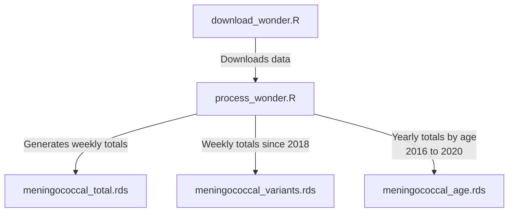

# Meningococcal disease vaccination model

## Data

Data is downloaded from the [CDC's Wonder website](https://wonder.cdc.gov/nndss/nndss_weekly_tables_menu.asp). They follow the case definitions specified by the [National Notifiable Disease Surveillance System](https://ndc.services.cdc.gov/conditions/meningococcal-disease/). Weekly data is available from 1996 to 2023. 

### Download process

Data is downloaded from the weekly reports using the `download_wonder.R` script. The script `process_wonder.R` generates the different data files. 

## Model

TBA